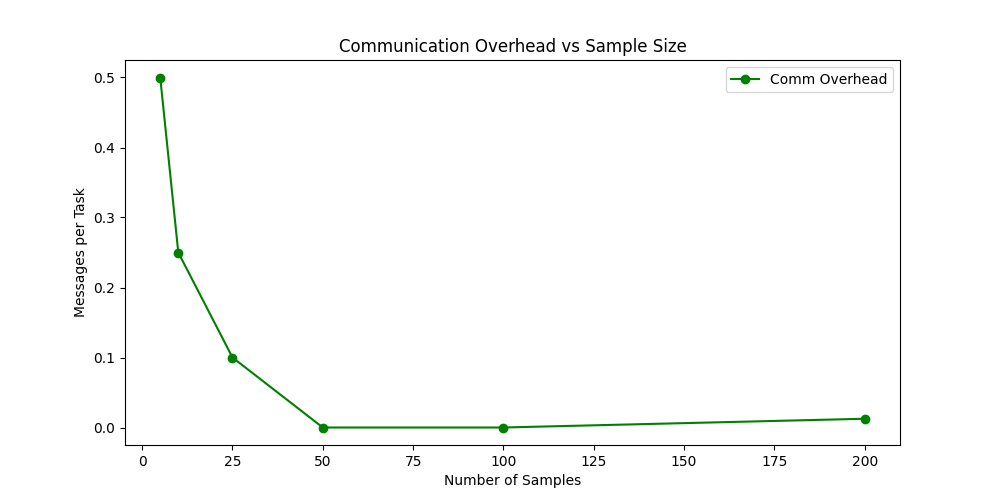
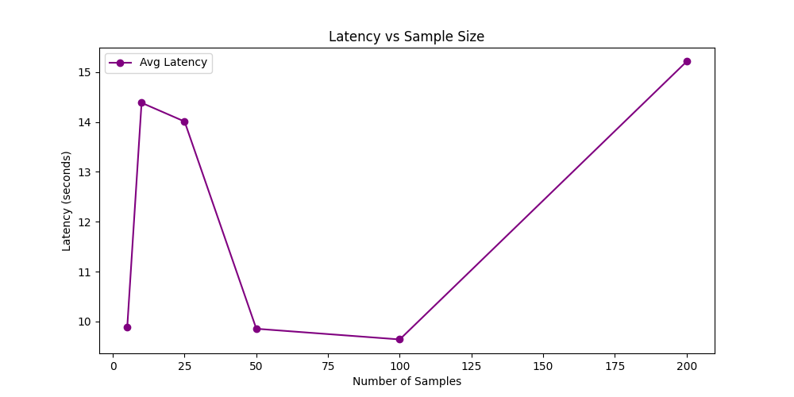

# The Disruptive Influence of (Multi-) Agent Systems on Traditional Software Architecture - Towards an Agent-Oriented Architecture Design Approach

## Overview

This repository contains an example implementation of the **Agent-Oriented Architecture (AOA)** design approach, a novel software architecture paradigm designed to accommodate the principles of **Multi-Agent Systems (MAS)**. AOA introduces **decentralized control, emergent coordination, and adaptive reasoning**, making it a viable alternative to traditional **Service-Oriented Architecture (SOA)** and **event-driven architectures**.

AOA and this implementation are the result of my **Master's thesis**:

**Title:** *The Disruptive Influence of (Multi-) Agent Systems on Traditional Software Architecture*  
**Subtitle:** *Towards an Agent-Oriented Architecture Design Approach*

This project serves as an experimental framework for testing scalability, adaptability, and coordination in distributed agent-based systems.

## Architecture

### Agent-Oriented Architecture
  
### Cognitive Agent
  
## Setup & Usage

### Prerequisites

#### Reasoning Model

The example implementation of cognitive agents uses a GPT model for reasoning. To obtain reproducible results, a **GPT-4o** model must be used, as experiments were conducted with a non-fine-tuned GPT-4o model. If exact reproducibility is not required, any other model can be used.

#### Host System Dependencies

Ensure the following dependencies are installed before running the system::

- Python **(=3.12)**
- Poetry **(for dependency management)**
- Docker **(required for Chroma)**
- Chroma **(for knowledge retrieval)**

### **Setup**

1. Clone this repository: `git clone https://github.com/foohardt/agent-oriented-architecture.git`
2. Navigate to the project root folder and activate the virtual environment: `poetry shell`
3. Install dependencies: `poetry install`
4. Create a .env file at project root folder and add the model API key: `OAI_API_KEY=12345abcde`

### Usage

1. Start Chroma: `sudo docker run -d -p 8000:8000 chromadb/chroma`
2. Seed the knowledge base: `poetry run python disrupt_arch/knowledge/seed.py `
3. Run main with example data: `poetry run python disrupt_arch/`

## Testing

The application uses pytest to perform unit tests and integration tests. All tests can be found in `disrupt_arch/tests`.

To run all tests:

1. Start Chroma: `sudo docker run -d -p 8000:8000 chromadb/chroma`
2. Seed knowledge base: `poetry run python disrupt_arch/knowledge/seed.py `
3. Activate virtual environment (from project root folder): `poetry shell`
4. Navigate to `disrupt_arch/tests`
5. Run `pytest`

### Unit Testing

Unit tests verify the correctness of individual system components, such as the agent base class and concurrent processing.

To run all unit tests, follow the instructions above, but instead running `poetry run pytest`, execute `poetry run pytest unit/`

To run a specific unit test, use `poetry run pytest path/to/test_file.py`

### Integration Testing

Integration tests evaluate complete workflows involving multiple agents. The measurement and collection of performance metrics are also integrated into these tests. For more information about metrics and experiments, see sections [Performance Metrics](#performance-metrics)  and [Experimental Results](#experimental-results).

To only run integration tests, follow the instructions above but instead running `poetry run pytest`, run `poetry run pytest integration/`

To run a single integration test, for example run `poetry run pytest disrupt_arch/tests/integration/test_escalation_workflow.py --log-cli-level=INFO`.

It is recommended to set the log level to `INFO` when running integration tests, to understand the communication between the agents.

## Performance Metrics

To evaluate the performance of the multi-agent system, five key performance metrics are defined:

### Execution Time (ET)

Measures the total time required to process all tasks within a test run. It reflects the overall efficiency of the system in completing its workload. Lower execution times indicate better performance.

$$
ET = T_{\text{end}} - T_{\text{start}}
$$

- Lower execution time implies higher efficiency.
- A significant increase in execution time may indicate performance bottlenecks in agent communication or task allocation.

### Agent Throughput (AT)

Quantifies the system’s capacity by measuring the number of tasks processed per second.

$$
AT = \frac{N_{\text{tasks}}}{ET}
$$

- Higher throughput indicates better scalability and computational efficiency.
- A sudden drop in throughput may signal system overload or excessive coordination overhead.

### Communication Overhead (CO)

Measures the average number of messages exchanged per task. It helps assess how efficiently agents coordinate without excessive inter-agent messaging.

$$
CO = \frac{N_{\text{messages}}}{N_{\text{tasks}}}
$$

- Low communication overhead suggests efficient coordination among agents.
- Very low overhead may indicate insufficient inter-agent communication, leading to poor task execution.
- High overhead suggests excessive messaging, potentially causing delays.

### Latency (L)

Measures the time delay between when an agent makes a decision and when the corresponding action is executed.

$$
L = \frac{1}{N} \sum_{i=1}^{N} (T_{\text{execution}, i} - T_{\text{decision}, i})
$$

- Lower latency suggests real-time adaptability.
- High latency may indicate delays due to inefficient task scheduling, network congestion, or agent processing overhead.

### Task Distribution Balance (TDB)

Evaluates how evenly tasks are distributed among agents. A well-balanced system ensures that no single agent is overloaded while others remain idle.

$$
TDB = \frac{\sigma(W)}{\mu(W)}
$$

- A TDB value close to zero indicates an evenly distributed workload.
- A high TDB value suggests that some agents are handling significantly more tasks than others, leading to inefficiencies.

## Experimental Results

The experimental evaluation of the multi-agent system (MAS) focused on its scalability, task coordination efficiency, and execution performance under varying workloads. The goal was to compare MAS execution against traditional centralized models, particularly analyzing throughput, task distribution balance, communication overhead, and latency.

### Functional and System Requirements Testing

The example implementation is based on a real-world scenario from the finance sector, specifically in debt collection management. Functional requirements were derived from user stories in this domain, ensuring practical relevance and applicability.

- **Unit testing**: Verified the correctness of individual components such as the agent registry and knowledge base.

  - The agent registry successfully managed task registrations and queues.
  - The knowledge base correctly retrieved relevant rules based on input queries.

- **Integration testing**: Focused on validating complete workflows, including:
  - **Risk assessment workflow**: Agents dynamically queried knowledge bases and reasoned about task delegation.
  - **Escalation workflow**: Tasks were escalated to specialized agents based on predefined logic.
  - **Installment plan creation**: Agents collaborated to generate installment plans based on financial risk analysis.

These tests confirmed that agents effectively communicated and dynamically delegated tasks, ensuring the system’s adaptability to varying conditions.

## Performance Metrics and Experimental Setup

To quantitatively assess the system, the following [performance metrics](#performance-metrics) were measured across multiple workloads:

| Sample Size | Execution Time (s) | Throughput (tasks/sec) | Communication Overhead | Latency (s) | Task Balance |
| ----------- | ------------------ | ---------------------- | ---------------------- | ----------- | ------------ |
| 5           | 9.88               | 1.01                   | 0.5                    | 9.88        | 0.95         |
| 10          | 14.38              | 1.39                   | 0.25                   | 14.38       | 0.98         |
| 25          | 14.01              | 3.56                   | 0.1                    | 0.7         | 14.00        |
| 50          | 9.85               | 10.14                  | 0.0                    | 1.1         | 9.85         |
| 100         | 9.64               | 20.74                  | 0.0                    | 2.5         | 9.64         |
| 200         | 15.21              | 26.29                  | 0.0125                 | 2.5         | 15.21        |

- **Execution time** remained stable up to 100 tasks, with a slight increase at 200 tasks, demonstrating MAS efficiency in dynamic workload management.
- **Throughput** increased significantly with workload, reaching 26.29 tasks/sec at 200 concurrent tasks.
- **Communication overhead** decreased as task volume increased, indicating optimized agent coordination.
- **Latency** remained closely correlated to execution time, suggesting potential for optimization in real-time task scheduling.
- **Task balance** improved with increasing workload, confirming effective task distribution among agents.

## Key Observations

### Scalability and Performance Efficiency

- Execution time **remained stable** up to 100 tasks, avoiding the linear degradation seen in traditional architectures.
- The **nonlinear increase in throughput** demonstrated MAS’s advantage in concurrency-based execution.

  
  

### Task Distribution and Load Balancing

- **Early inefficiencies** in task distribution were observed at smaller workloads.
- At **higher workloads**, task balance improved significantly, achieving an optimal **98.75 at 200 tasks**.

  

### Communication Overhead and Coordination Efficiency

- Low workloads exhibited **higher overhead** due to initial agent coordination efforts.
- At **higher task volumes, communication overhead was near zero**, indicating efficient decentralized execution.

  

### Latency and Real-Time Processing Considerations

- **Latency remained equivalent to the total execution time**, suggesting potential queuing delays before execution
- Further optimization in **task scheduling** may enhance real-time processing capabilities.

  

## Conclusion and Future Considerations

The experimental results confirm that multi-agent systems can outperform traditional architectures in handling scalability, adaptability, and distributed task execution. However, the findings highlight areas for future research:

1. **Reducing latency** via improved task allocation strategies.
2. **Optimizing inter-agent communication** to further reduce bottlenecks.
3. **Introducing advanced agent interaction patterns** to further enhance agent collaboration and competition to solve complex problems effectively.
4. **Enhancing (real-time) agent observability, evaluation, and debugging mechanisms** to track agent decision-making and improve explainability.

## Contact

For inquiries, feel free to reach out or open an issue
